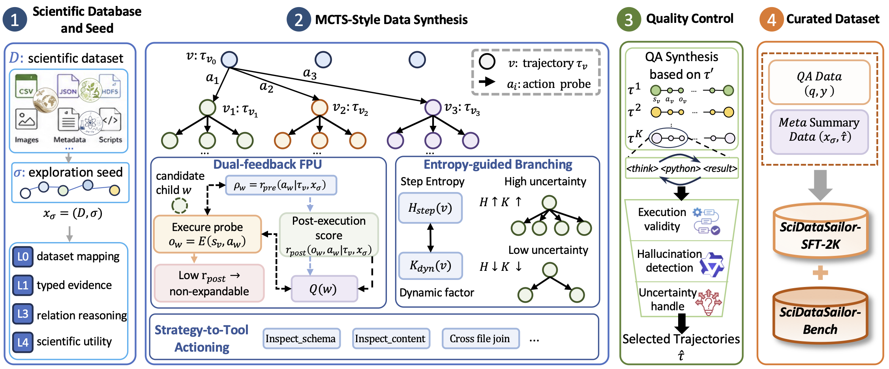

<h1 align="center"> SciDataSailor </h1>

<h3 align="center">Deep Scientific Data Exploring with Tool-Interactive Trajectory Synthesis</h3>

<p align="center">
  <a href="https://arxiv.org/abs/2602.09132">📄Paper</a> •
  <a href="https://github.com/SciDataOcean/SciDataSailor">💻Code</a> •
  <a href="#citation">✍️Citation</a>
</p>

<div align="center">

[](https://github.com/SciDataOcean/SciDataSailor)


</div>

## Table of Contents

- 🔔 [News](#news)
- 👀 [Overview](#overview)
- 🧩 [Framework](#framework)
- 🔧 [Installation](#installation)
- 📁 [Project Structure](#project-structure)
- 🚀 [Quick Start](#quick-start)
- 🧪 [Quality Control](#quality-control)
- 📦 [Data Export](#data-export)
- ⚙️ [Configuration](#configuration)
- ✍️ [Citation](#citation)

---

<a id="news"></a>

## 🔔 News

- **[2026-05]** We release the initial SciDataSailor codebase for tool-interactive scientific data trajectory synthesis, QA construction, and deterministic quality control.

- **[2026-05]** We provide the paper: **SciDataSailor: Deep Scientific Data Exploring**.

<a id="overview"></a>

## 👀 Overview

The pace of modern scientific discovery is constrained by the rigorous preparation and analysis of raw datasets. Scientific repositories typically span hierarchical file systems and heterogeneous formats, making their processing labor-intensive and discipline-dependent. **SciDataSailor** addresses this gap by synthesizing tool-interactive scientific data trajectories in realistic data environments.

At its core, SciDataSailor formulates trajectory generation as a Monte Carlo Tree Search (MCTS) process with four key designs: seed difficulty taxonomy, dual-feedback first-play urgency, hierarchical strategy-to-tool action decomposition, and entropy-guided branching.

Concretely, this repository supports:

- **MCTS-style trajectory synthesis** with dual-feedback first-play urgency, entropy-guided branching, and optional hierarchical strategy-to-tool actioning.
- **Long-horizon trajectory sampling** for generating multi-hop ReAct meta summary trajectories that preserve evidence-gathering processes.
- **QA synthesis** from selected meta summary trajectories, producing questions and answers grounded in executed observations.
- **Manifest-aware quality control** that scores grounding, coverage, execution quality, answer quality, and efficiency.
- **SFT data transformation** that converts validated trajectories into post-training corpora.

Together, these components scale the synthesis of diverse, long-horizon trajectories for evidence-grounded scientific data understanding. We curate **SciDataSailor-SFT-2K** for supervised post-training and **SciDataSailor-Bench** over 27 raw datasets across life, earth, and physical sciences; within the Qwen3 family, our fine-tuned 14B model substantially outperforms same-scale base models and approaches the larger 32B model.

<a id="framework"></a>

## 🧩 Framework

The current codebase centers on the `Trajectory Synthesis` pipeline, as illustrated below.

<p align="center">
  <a href="figures/Framework.png">
    
  </a>
</p>

<a id="installation"></a>

## 🔧 Installation

### Prerequisites

- Python 3.10+.
- Anaconda or Miniconda.

### Environment Setup

```bash
conda create -n scidata python=3.10 -y
conda activate scidata

pip install -r requirements.txt
```

<a id="project-structure"></a>

## 📁 Project Structure

```text
.
├── requirements.txt
├── src/
│   ├── llm_client.py
│   ├── utils.py
│   └── tools/
│       ├── base_tool.py
│       ├── python_tool.py
│       └── tool_executor.py
├── tasks/
│   ├── quality_check.py
│   ├── quality_check_v2.py
│   └── test_sci_questions.json
└── trajectory_synthesis/
    ├── sci_pipeline.py
    ├── trajectories_to_tir.py
    ├── convert_synthesized_qa_to_sft.py
    ├── stage1_run_synthesis.sh
    ├── stage2-batch_trajectories_to_tir.py
    ├── configs/
    │   └── my_dataset_mcts_config.json
    │   └── ..._mcts_config.json
    ├── seeds/
    │   └── seeds.jsonl
    ├── core/
    ├── prompt/
    └── utils/
```

<a id="quick-start"></a>

## 🚀 Quick Start

### 1. Prepare a Config

Start from the provided config file and edit the runtime fields for your environment:

```bash
cp trajectory_synthesis/configs/WTCCC1_mcts_config.json \
   trajectory_synthesis/configs/my_dataset_mcts_config.json
```

At minimum, update these fields in your config:

```json
{
  "model_name": "your_model_name",
  "base_url": "${OPENAI_BASE_URL}",
  "api_key": "${OPENAI_API_KEY}",
  "conda_path": "${CONDA_PATH}",
  "conda_env": "scidata",
  "dataset_path": "${DATASET_PATH}",
  "sampler_mode": "tooltree_mcts"
}
```

`sci_pipeline.py` resolves `${ENV_VAR}` placeholders in config values. You may also override `--endpoints`, `--api_keys`, `--conda_path`, `--conda_env`, and `--dataset_path` from the CLI. The model name is read from the config.

### 2. Prepare Seeds

Seeds are JSONL records under `trajectory_synthesis/seeds/`. Each non-empty line must contain a `content` field:

```json
{"content": "** Dataset structure exploration **: Explore the dataset hierarchy and summarize how files and outputs are organized."}
{"content": "** Numerical statistics and distribution analysis **: Compute descriptive statistics and identify notable patterns."}
...
```

The default seed file is:

```text
trajectory_synthesis/seeds/seeds.jsonl
```

### 3. Run Trajectory Synthesis

```bash
export OPENAI_BASE_URL="https://your-openai-compatible-endpoint/v1"
export OPENAI_API_KEY="your_api_key"
export CONDA_PATH="/path/to/miniconda3"
export DATASET_PATH="/path/to/scientific/dataset"

bash trajectory_synthesis/stage1_run_synthesis.sh
```

Outputs:

- `trajectory_synthesis/results/my_dataset/trajectories.jsonl`
- `trajectory_synthesis/results/my_dataset/synthesized_qa.jsonl`

You can directly use the script:

```bash
DATASET_PATH="/path/to/scientific/dataset" \
bash trajectory_synthesis/stage1_run_synthesis.sh \
  --config trajectory_synthesis/configs/my_dataset_mcts_config.json \
  --output-dir trajectory_synthesis/results/my_dataset
```

### 4. Quality Control & Convert Trajectories

Convert, score, and export training data in one step:

```bash
python trajectory_synthesis/stage2-batch_trajectories_to_tir.py \
  --qc-extra -- --sft_threshold 30 --rl_threshold 10
```

<a id="quality-control"></a>

## 🧪 Quality Control (Optional)

The [Step 4](#4-quality-control--convert-trajectories) already runs quality control and trajectory end to end. Use this optional standalone script only when you want to inspect trajectory quality separately, tune thresholds without rerunning the full pipeline.

`quality_check_v2.py` is the recommended standalone scorer for current outputs. It builds a lightweight manifest from `input_path`, derives coverage targets, and scores each trajectory using:

- grounding;
- repository coverage;
- execution validity and informativeness;
- answer quality;
- interaction efficiency.

Run standalone quality inspection:

```bash
python tasks/quality_check_v2.py \
  --tir_file trajectory_synthesis/results/my_dataset/results_tir.json \
  --output_dir trajectory_synthesis/results/my_dataset/quality_output_v2 \
  --save_normalized_trajectory \
  --sft_threshold 30 \
  --rl_threshold 10
```

<a id="data-export"></a>

## 📦 Data Export (Optional)

### Meta Summary to SFT

`trajectories_to_tir.py` converts selected meta summary trajectories into records with this shape:

```json
{
  "task_id": "my_dataset",
  "instruction": "...",
  "input": "seed intent",
  "input_path": "/path/to/scientific/dataset",
  "prediction": "<think>...</think><answer>...</answer>",
  "output": "<think>...</think><python>...</python>...<answer>...</answer>",
  "logs": ["<think>...</think> <python>...</python>", "<result>...</result>"...,"<think>...</think><answer>...</answer>"]
}
```

### QA to SFT

For QA data generated in `synthesized_qa.jsonl`, use:

```bash
python trajectory_synthesis/convert_synthesized_qa_to_sft.py \
  --results-root trajectory_synthesis/results/my_dataset \
  --expected-datasets 0
```

For a results root containing multiple dataset subdirectories, use `--start-dataset`, `--end-dataset`, and `--expected-datasets` to select a sorted inclusive range.

<a id="configuration"></a>


<a id="citation"></a>

## ✍️ Citation

If you find this work helpful, please cite:

```bibtex
@misc{rao2026scidatasailor,
  title = {SciDataSailor: Deep Scientific Data Exploring},
  author = {Jiyong Rao, Yicheng Qiu, Chi Zhang, Chunfeng Song, Shengjie Zhao and Runkai Zhao},
  year = {2026},
}
```
